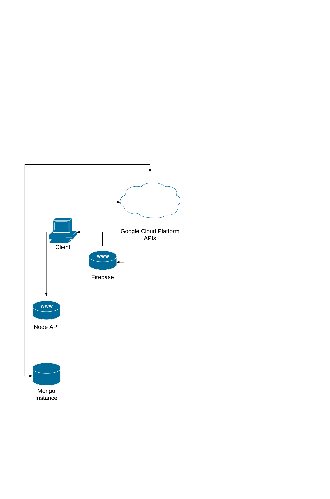

## Figures

### Figure 1--Auth Use Case

Figure 1--Auth Use Case

### Figure 2--Conceptual Module Overview

Figure 2--Conceptual Module Overview

### Figure 3--Full Physical Implementation

Figure 3--Full Physical Implementation

### Figure 4--Mid Physical Implementation

Figure 4--Mid Physical Implementation

### Figure 5--Small Physical Implementation

Figure 5--Small Physical Implementation
