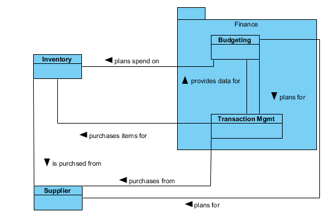
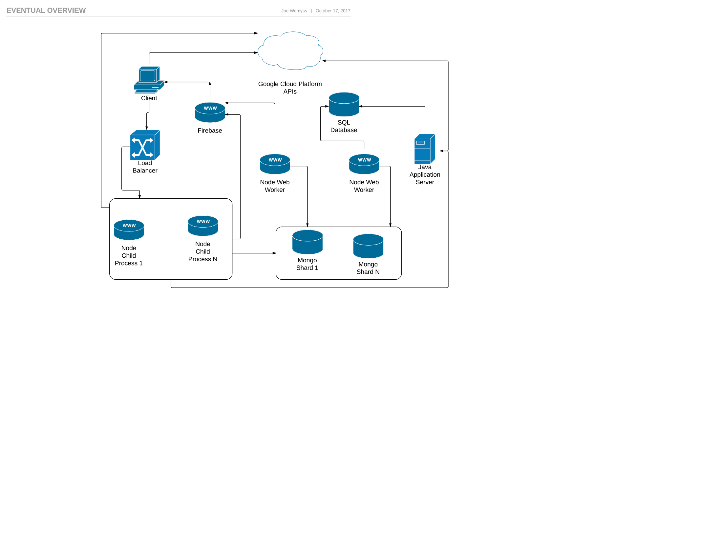

#Appendix

## Figures

### Figure 1--Auth Use Case

Figure 1--Auth Use Case

### Figure 2--Conceptual Module Overview

Figure 2--Conceptual Module Overview

### Figure 3--Full Physical Implementation

Figure 3--Full Physical Implementation

### Figure 4--Mid Physical Implementation

Figure 4--Mid Physical Implementation

### Figure 5--Small Physical Implementation

Figure 5--Small Physical Implementation
  # References 
  
  ## Ambler, S, 2016
  
  Author: Ambler, Scott
  
  Year: 2016
  
  Title: The Disiplined Agile Framework -- The Principals of Lean Software Development
  
  URL: http://www.disciplinedagiledelivery.com/lean-principles/
  
  Accessed On: 03/11/2017
   
  
  ## Capgemini, 2017
  
  Author: Capgemini
  
  Year: 2017
  
  Title: Big and Fast Data: The Rise of Insight Driven Business
  
  URL: https://www.capgemini.com/wp-content/uploads/2017/07/big_fast_data_the_rise_of_insight-driven_business-report.pdf
  
  Accessed On: 02/11/2017
   
  
  ## ExpertsExchange, 2014
  
  Author: ExpertsExchange
  
  Year: 2014
  
  Title: Waterfall Model Pros and Cons
  
  URL: https://www.experts-exchange.com/articles/17441/Waterfall-Model-pros-and-cons.html
  
  Accessed On: 02/11/2017
   
  
  ## Gartner, 2017
  
  Author: Gartner
  
  Year: 2017
  
  Title: Gartner Says Worldwide IT Spending Forecast to Grow 2.4 Percent in 2017
  
  URL: https://www.gartner.com/newsroom/id/3759763
  
  Accessed On: 02/11/2017
   
  
  ## Google (A), 2017
  
  Author: Google
  
  Year: 2017
  
  Title: Firebase
  
  URL: https://firebase.google.com/
  
  Accessed On: 04/11/2017
   
  
  ## Google (B), 2017
  
  Author: Google
  
  Year: 2017
  
  Title: Firebase Web Authentication
  
  URL: https://firebase.google.com/docs/auth/web/start
  
  Accessed On: 04/11/2017
   
  
  ## Google (C), 2017
  
  Author: Google
  
  Year: 2017
  
  Title: Firebase Server Authentication
  
  URL: https://firebase.google.com/docs/auth/admin/
  
  Accessed On: 02/11/2017
   
  
  ## Google (D), 2017
  
  Author: Google
  
  Year: 2017
  
  Title: Firebase Cloud Functions Use Cases
  
  URL: https://firebase.google.com/docs/functions/use-cases
  
  Accessed On: 03/11/2017
   
  
  ## Google (E), 2017
  
  Author: Google
  
  Year: 2017
  
  Title: Firebase Real Time Database
  
  URL: https://firebase.google.com/docs/database/web/start
  
  Accessed On: 04/11/2017
   
  
  ## Google (F), 2017
  
  Author: Google
  
  Year: 2017
  
  Title: Firebase Cloud Firestore
  
  URL: https://firebase.google.com/docs/firestore/quickstart
  
  Accessed On: 03/11/2017
   
  
  ## Kumar, V, 2017
  
  Author: Kumar, Vishal
  
  Year: 2017
  
  Title: Analytics Week -- Big Data Facts
  
  URL: https://analyticsweek.com/content/big-data-facts/
  
  Accessed On: 02/11/2017
   
  
  ## LEANKit, 2017
  
  Author: LEANKit
  
  Year: 2017
  
  Title: What is Kanban
  
  URL: https://leankit.com/learn/kanban/what-is-kanban/
  
  Accessed On: 02/11/2017
   
  
  ## Nagy, J, 2015
  
  Author: Nagy, James
  
  Year: 2015
  
  Title: JSTechDesign s-- UX: Dont be too rigid
  
  URL: https://www.jstechdesigns.com/Blog/ux-dont-be-too-rigid
  
  Accessed On: 02/11/2017
   
  
  ## Pittet, S, 2017
  
  Author: Pittet, Sten
  
  Year: 2017
  
  Title: Atlassian -- Continuous integration vs. continuous delivery vs. continuous deployment
  
  URL: https://www.atlassian.com/continuous-delivery/ci-vs-ci-vs-cd
  
  Accessed On: 03/11/2017
   
  
  ## ScrumGuides, 2016
  
  Author: ScrumGuides
  
  Year: 2016
  
  Title: The Scrum Guide
  
  URL: http://www.scrumguides.org/scrum-guide.html
  
  Accessed On: 02/11/2017
   
  
  ## TheLeanStartup, 2017
  
  Author: TheLeanStartup
  
  Year: 2017
  
  Title: The Lean Startup -- Methodology
  
  URL: http://theleanstartup.com/principles
  
  Accessed On: 04/11/2017
   
  
  ## Weigers, K, 2003
  
  Author: Weigers, Karl
  
  Year: 2003
  
  Title: Software Requirements
  
  Publisher: Microsoft
   
  
  ## Wilcox, R, 2017
  
  Author: Wilcox, Ryan
  
  Year: 2017
  
  Title: Toptal -- Your Boss Won't Appreciate TDD: Try This Behavior-Driven Development Example
  
  URL: https://www.toptal.com/freelance/your-boss-won-t-appreciate-tdd-try-bdd
  
  Accessed On: 03/11/2017
  